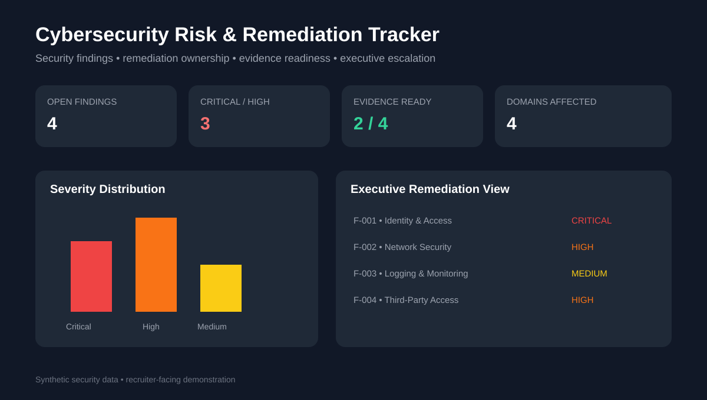

# Cybersecurity Risk & Remediation Tracker

A recruiter-facing cybersecurity program dashboard demonstrating how a Security Program Manager can coordinate findings, remediation ownership, due dates, evidence readiness, and executive escalation.



## Business Problem

Security remediation often spans engineering, infrastructure, identity, SOC, OT, compliance, and business teams. Leadership needs a concise view of severity, ownership, progress, evidence, and residual risk.

## What This Project Demonstrates

- Cybersecurity program governance
- Risk and finding prioritization
- Critical / high-severity escalation
- Remediation ownership and due-date management
- Evidence readiness for audits and control validation
- Executive reporting and risk acceptance support
- Cross-functional security delivery coordination

## Executive KPIs

- Open findings
- Critical / high findings
- Evidence-ready findings
- Domains affected
- Remediation status distribution
- Upcoming / overdue items

## Run the Dashboard

```bash
pip install -r requirements.txt
streamlit run app.py
```

## Repository Structure

- `app.py` — interactive Streamlit remediation dashboard
- `assets/dashboard-preview.svg` — executive dashboard preview
- `data/security_findings.csv` — synthetic security findings
- `src/risk_summary.py` — risk and evidence summary logic
- `governance/security_program_cadence.md` — weekly, biweekly, and monthly governance model

## Leadership Decisions Supported

This dashboard helps answer: Which high-risk findings remain unresolved? Where is audit evidence incomplete? Which remediation teams are constrained? Which items require escalation, funding, or formal risk acceptance?

> All security data is synthetic and provided solely for demonstration purposes. No confidential employer, client, vulnerability, or infrastructure information is included.
